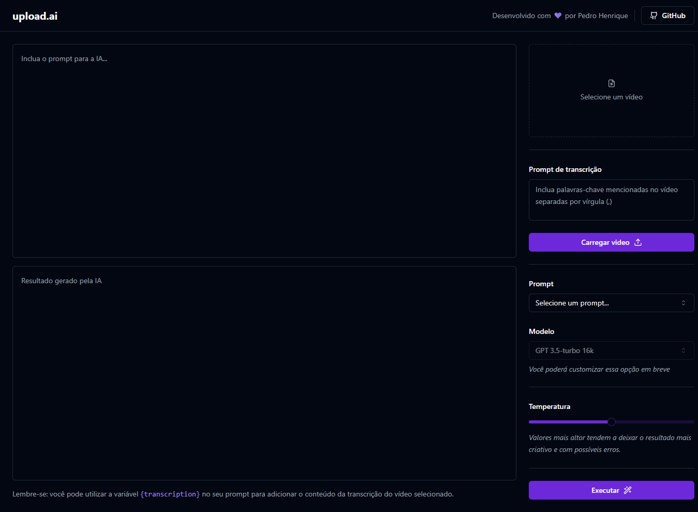

<h1 align="center">Upload AI</h1>

  

## 📒 Descrição

Aplicação que possibilita realizar upload de videos e por meio de IA, criar automaticamente títulos chamativos e descrições com um boa indexação.

## 📚 Funcionalidades

- [x] Criar títulos chamativos e descrições com uma boa indexação

## 🔧 Tecnologias utilizadas

- Front-end:
  - Typescript
  - React
  - Lucide React
  - Tailwind
  - Radix UI
  - Shadcn UI
  - Axios

- Back-end:
  - Node.js
  - Express
  - Fastify
  - Cors
  - Prisma
  - AI
  - Openai
  - Zod

- Banco de Dados:
  - SQLite

## 🤝 Criador

<table>
  <tr>
    <td align="center">
      <a href="#">
         
        
          <b>Pedro Henrique</b>
        
      </a>
    </td>
  </tr>
</table>

## 🎯 Status do projeto

O projeto está finalizado.

## :memo: Licença

Esse projeto está sob a licença MIT. Veja o arquivo [LICENSE](https://github.com/eupedrohenrique/upload-ai/blob/main/LICENSE) para mais detalhes.